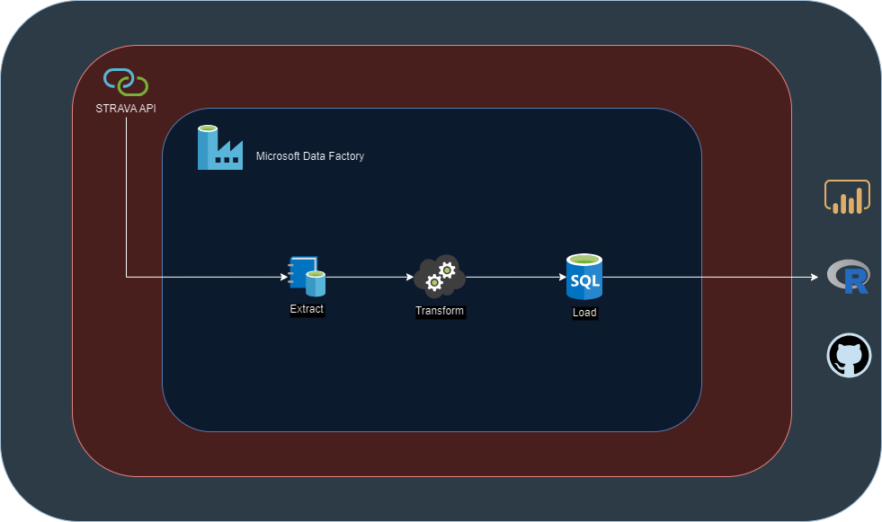

# Objetivo

Visualizar os dados armazenados na base de dados do aplicativo Strava (www.strava.com) e realizar a carga para o ambiente Azure Data Factory, processar as informações e carrega-las em banco de dados relacional para responder as seguintes questões:

-   Determinar o total de distância percorrida em Kms

-   Maiores médias de batimentos cardíacos e os Kms percorridos

-   Total de distância por tipo de atividade

-   As 10 maiores distâncias percorridas

-   Visualizar os poligonos no mapa usando api do Google Maps

# Detalhamento

Utilizando-se da ferramenta da Microsoft Azure Data Factory será realizado a conexão a API do Strava processar as informações e carrega-las para um banco de dados relacional para a realização de consultas através de outras ferramentas.

## Fonte de Dados

A fonte de dados utiizada foi api do aplicativo STRAVA que contempla informações dos usuários, como atividades de ciclismo, corrida entre outros. As informações disponíveis são de uso do próprio usuário registrado no aplicativo e seguindo as suas regras.

A documentação sobre a autenticação pode ser obtida no endereço Strava Developers. (https://developers.strava.com)

## Coleta

A extração dos dados foi realizada através de conexão com a API do aplicativo, conforme configurado abaixo.

## Modelagem

Recebido os dados é realizado a seleção e o tratamento das informações que se deseja analisar e prepara-las para a carga.

## Carga

Após a seleção dos dados realizamos a carga no banco de dados relacional Azure SQL Database

No processo de inserção dos dados é verificado o relacionado das colunas

## Análise
