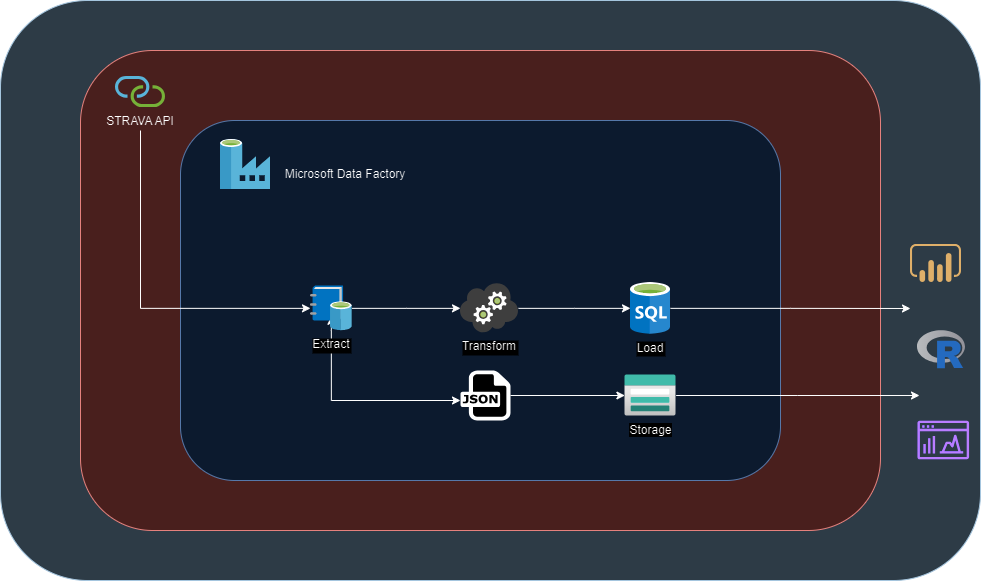

# Objetivo

Através da conexão a fonte de dados do provedor do aplicativo, a carga para o ambiente Azure Data Factory com o devido processado dos dados e seu armazenamento em banco de dados relacional espera-se obter as seguintes informações:

-   Determinar o número de maior distância percorrida em Km

-   Maiores médias de batimentos cardíacos por trecho percorrido

-   Total de distância por atividade

-   As 10 maiores distâncias percorridas

# Detalhamento

## Fonte de Dados

A fonte de dados utiizada foi do aplicativo STRAVA que registra informações dos usuários, como atividades de ciclismo, corrida entre outros. Os dados são de uso do próprio usuário registrado nos bancos de dados do aplicativo.

A documentação sobre a autenticação pode ser obtida no endereço Strava Developers.

## Coleta

## Modelagem

## 

## Carga

## Análise
