MVP - Disciplina: Sprint: Engenharia de Dados

PUC-RIO

Tales Gonçalves

# Objetivo

Extrair os dados armazenados na base de dados do aplicativo Strava (www.strava.com), realizar a carga para o ambiente Azure Data Factory, processar as informações e carrega-las em banco de dados relacional para responder as seguintes questões:

-   Determinar o total de distância percorrida em Kms

-   Maiores médias de batimentos cardíacos e os Kms percorridos

-   Total de distância por tipo de atividade

-   As 10 maiores distâncias percorridas

-   Visualizar os poligonos no mapa usando api do Google Maps

# Detalhamento

Utilizando-se da ferramenta Microsoft Azure Data Factory é realizado a conexão com a API do Strava. Os dados são extraídos, as informações tratadas e depois carregadas para o banco de dados relacional SQLDatabase para a realização de consultas através de outras ferramentas. No exemplo também foi-se utilizado a extração de dados referente aos polígos com as coordenadas geográficas, tratos e carregados em arquivo Json disponível em Storage na Azure.

## Fonte de Dados

A fonte de dados escolhida foi a do aplicativo STRAVA, disponível através de API, que contempla informações de usuários como atividades de ciclismo, corrida entre outras modalidades. As informações disponíveis são de uso do próprio usuário registrado no aplicativo e seguindo as suas regras.

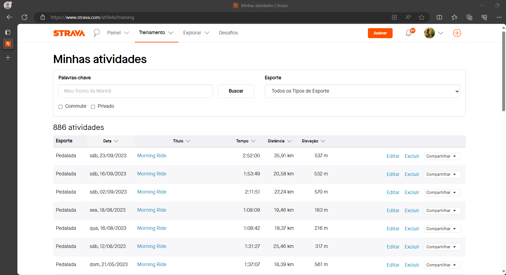{width="900"}

A documentação sobre a API pode ser obtida no endereço Strava Developers. (<https://developers.strava.com>)

[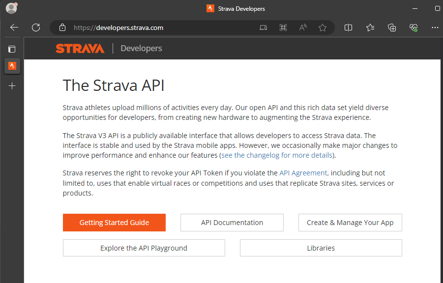](https://developers.strava.com/)

# O Processo

O processo completo utilizado no Azure Data Factory, criou Datasets, Data flows e o pipeline que executa o fluxo dos dados.

## Coleta

A extração dos dados é realizada através de conexão com a API do aplicativo, configurado como um Dataset.

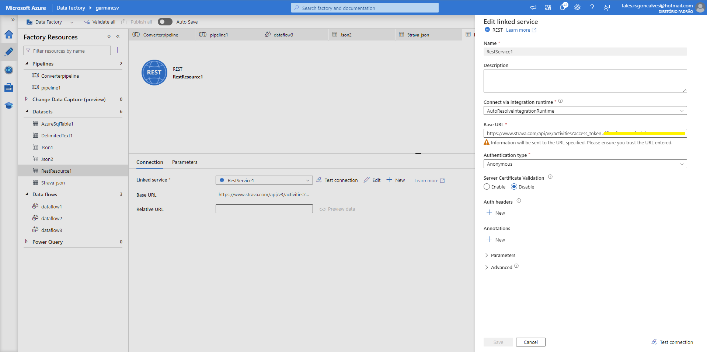

Após a conexão os dados são carregados para o inicio do tratamento dentro do data source. Neste exemplo utilizou-se uma replicação do data source para separar alguns dados.

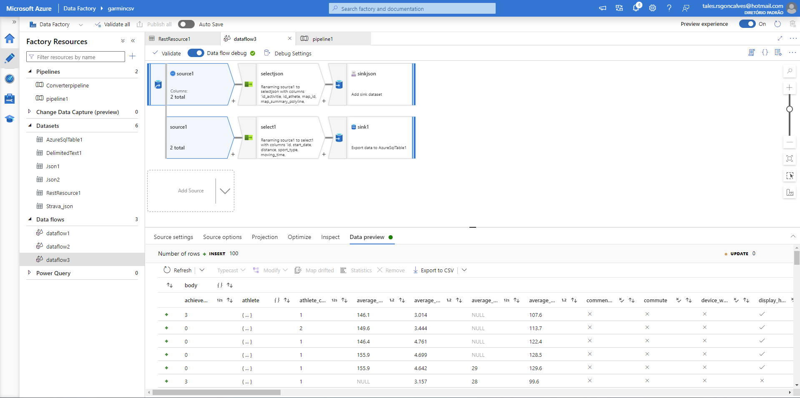

## Modelagem

Neste exemplo foram utilizados duas etapas de tratamento dos dados, uma selecioando os dados para armazenamento em banco de dados e outra seleção para o armazenamento dos polígonos com as coordenadas geográficas do percurso percorrido salvos em arquivo Json.

Após a seleção dos dados é feito o mapeamento das informações e definido o nome das colunas que serão carregadas no banco de dados.

Seguindo a estapa acima é feito nova seleção dos dados sobre os poligonos das coordenadas geográficas.

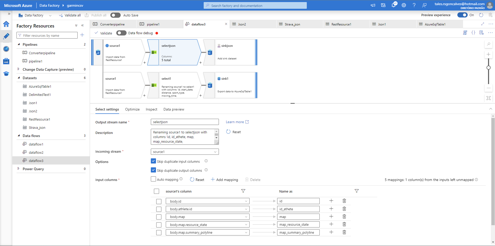

## Carga

Após a seleção dos dados, realizamos a carga no banco de dados relacional, aqui utilizamos Azure SQL Database, que segue o modelo abaixo:

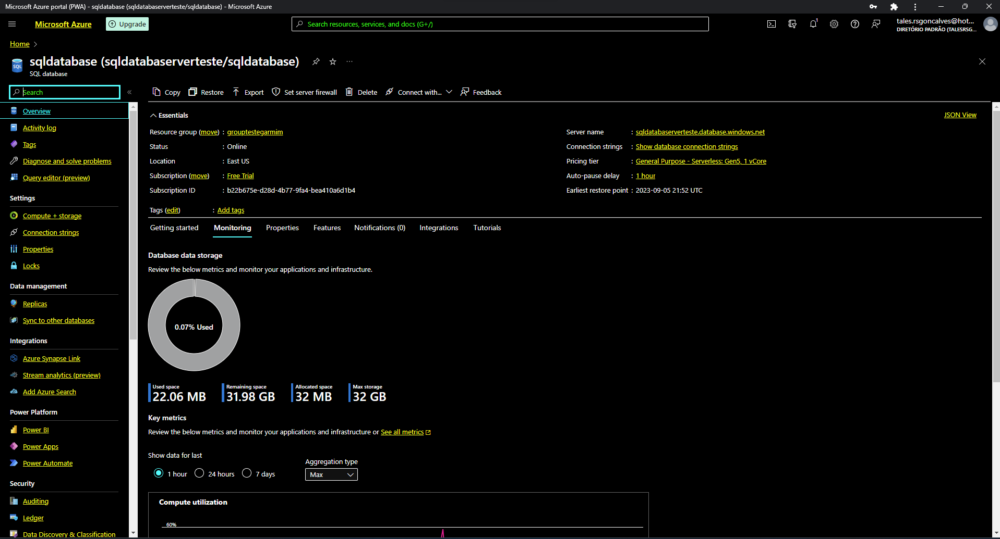

Sendo criado um schema no banco de dados com a seguinte tabela: StravaActivities

| Chave |       Nome        |     Tipo     |                                               Descrição                                               |
|:------------:|:------------:|:------------:|:-----------------------------:|
|  PK   |        Id         |   inteiro    |      Código que identifica o registro da atividade. Chave primária. Campo não recebe valor nulo.      |
|       |    start_date     | alfanumérico | Registro da data em que a atividade foi registrada na base de dados. Campo aceita receber valor nulo. |
|       |     distance      |   decimal    |       Registra a quilometragem percorrida durante a atividade. Campo aceita receber valor nulo.       |
|       |    sport_type     | alfanumérico |                Registra o tipo de atividade praticada. Campo aceita receber valor nulo                |
|       |    moving_time    |   inteiro    |          Registra o tempo em movimento durante a atividade. Campo aceita receber valor nulo.          |
|       | average_heartrate |   decimal    |    Registra a média de batimentos cardíacos durante a atividade. Campo aceita receber valor nulo.     |
|       |   average_speed   |   decimal    |           Registra a velocidade média durante a atividade. Campo aceita receber valor nulo.           |

: Schema dbo.StravaActivites

Visão do schema e tabela criados.

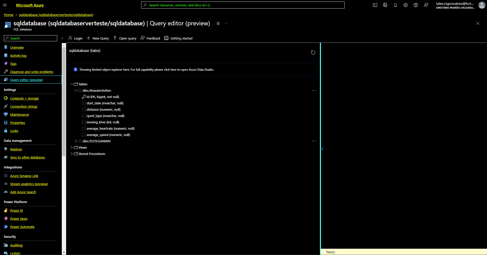

Para a relalização da carga no banco de dados de destino é configurado as informações do nome do banco e a tabela de destino.

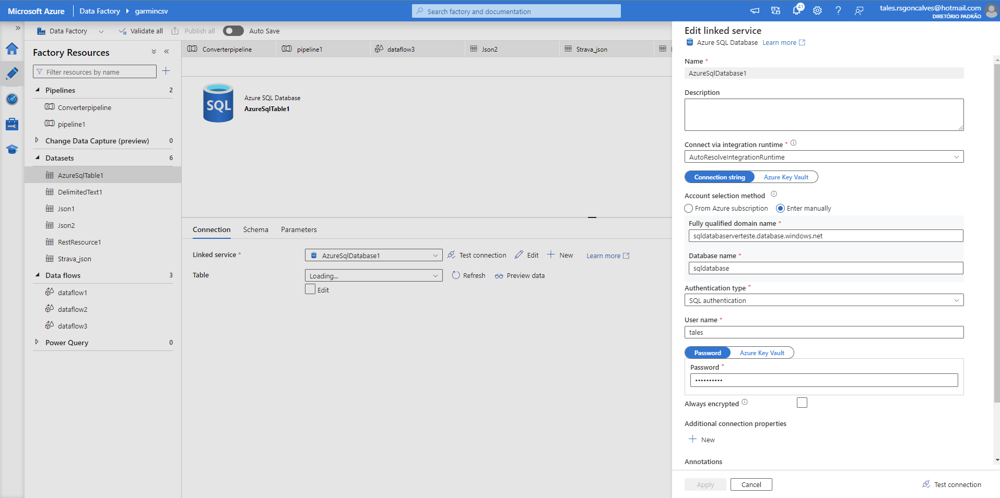

Configuração do fluxo

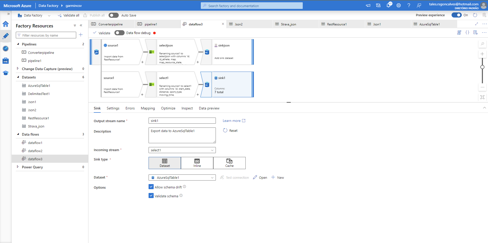

No processo de inserção dos dados é verificado o relacionado das colunas

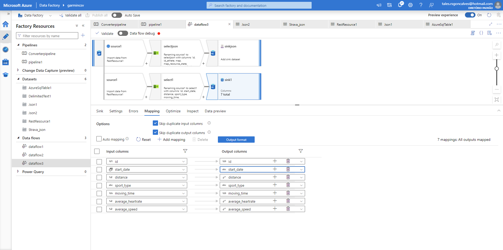

Para a arquivo em Json com os polígonos do mapa é configurando um ambiente de Storage para armazenamento do arquivo.

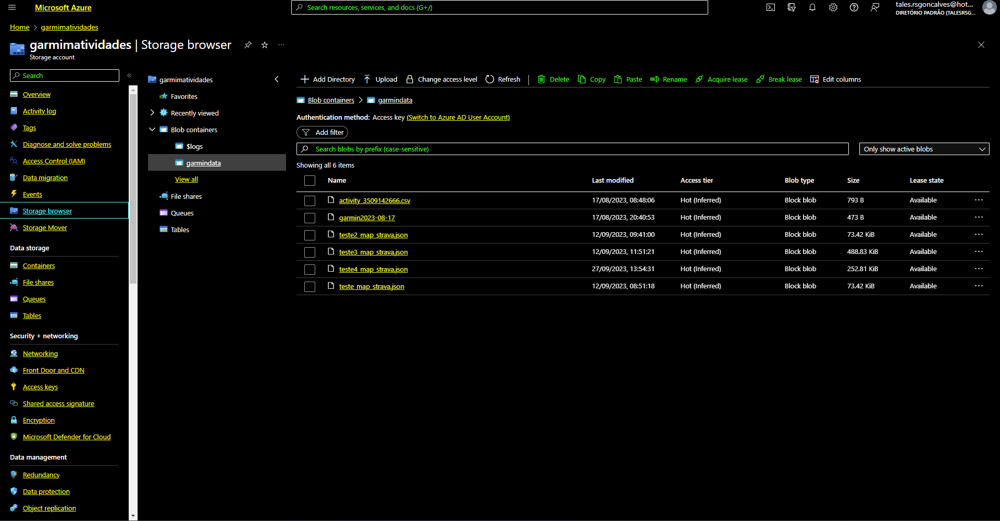

A configuração da saída do arquivo ocorre no fluxo

## Pipeline

Estabelecido todo o fluxo de extração, transformação e carga dos dados.

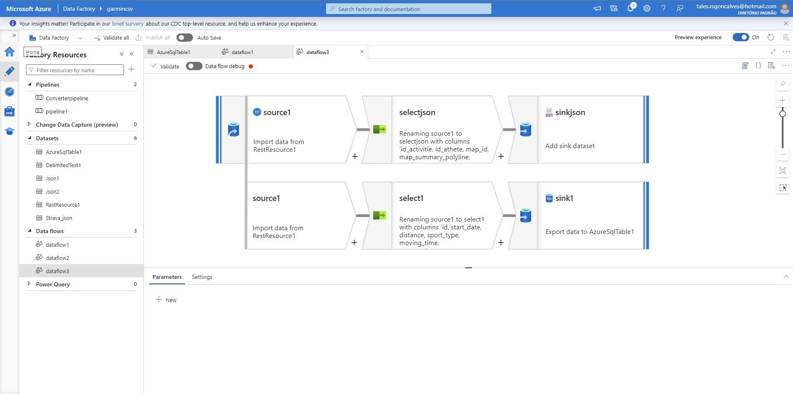

Configuração do pipeline para a execução do processo e a efetivação dos dados na base de dados de destino.

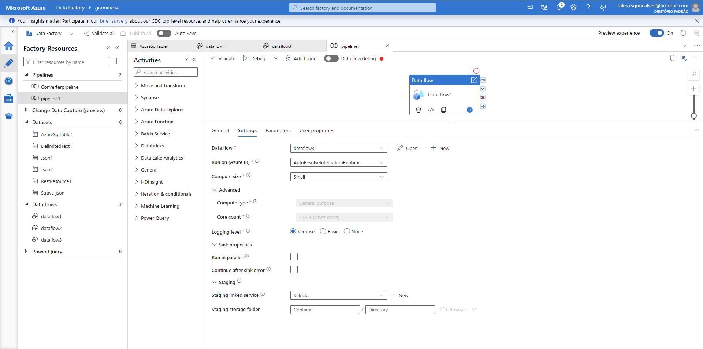

Resultado do processo concluído

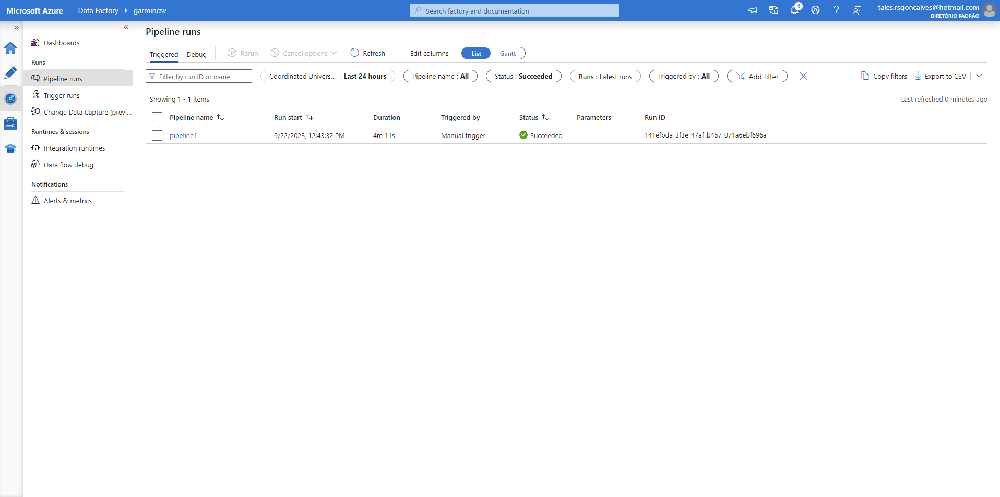

## Análise

Após o pipeline executado com sucesso validamos os dados no banco de dados

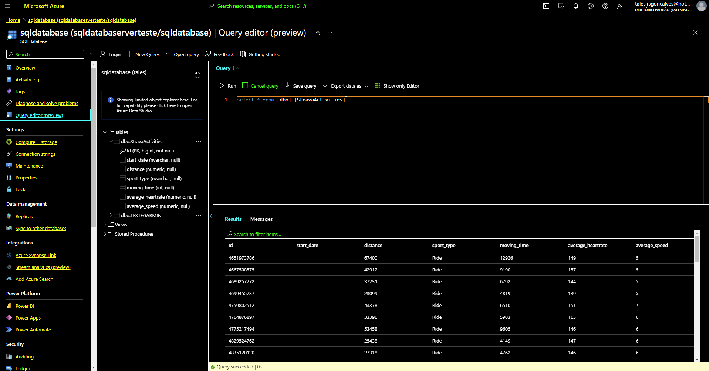

Também verificamos as gravação dos arquivo no container

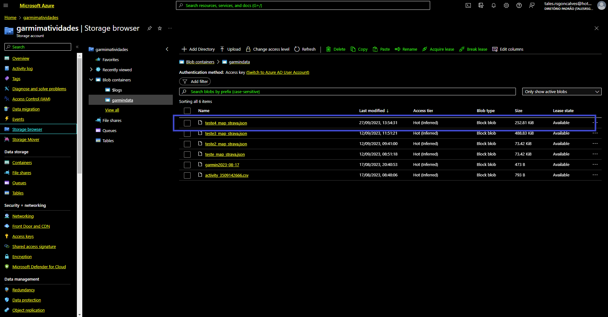

Foi possível verificar que o campo data não foi carregado corretamente no banco de dados, validado que a conexão com a API ocorreu com sucesso, observou-se que não carregou o valores para o campo start_date. Realizado teste em outras aplicações o mesmo não ocorreu, por falta de tempo e melhores dominio sobre a conexão com a API a informação não será tratada neste contexto.

Para uma melhor análise das informações foi usado a linguagem R confome link para o arquivo abaixo.

[mvp_dados.Rmd](mvp_dados.Rmd)
