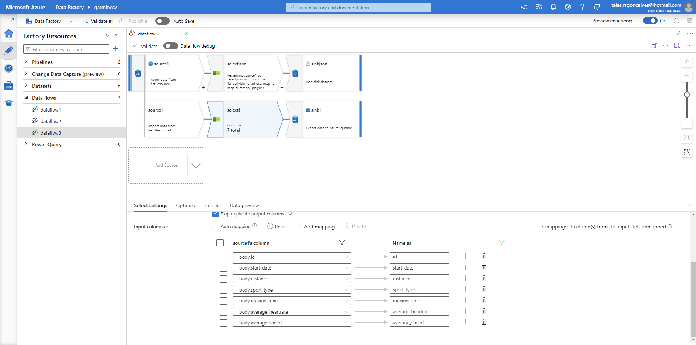
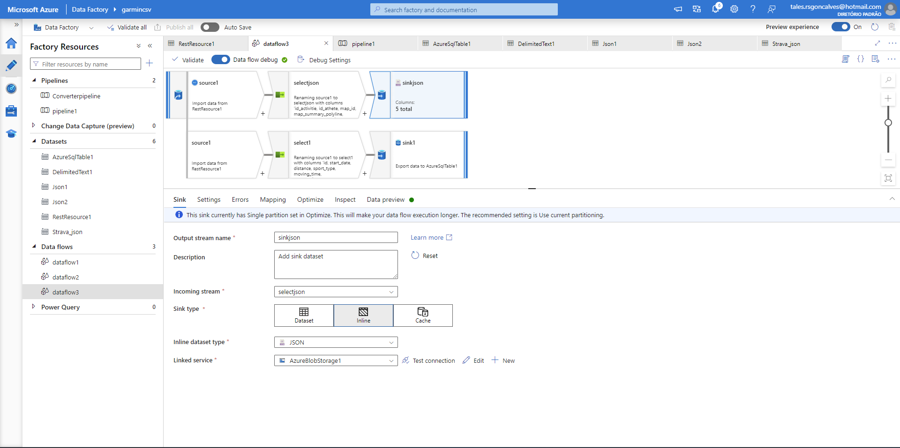

MVP - Disciplina: Sprint: Engenharia de Dados

PUC-RIO

Aluno: Tales Gonçalves

# Objetivo

Extrair os dados armazenados na base de dados do aplicativo Strava (www.strava.com), realizar a carga para o ambiente Azure Data Factory, processar as informações e carrega-las em banco de dados relacional para responder as seguintes questões:

-   Determinar o total de distância percorrida em Kms

-   Maiores médias de batimentos cardíacos e os Kms percorridos

-   Total de distância por tipo de atividade

-   As 10 maiores distâncias percorridas

-   Visualizar os poligonos no mapa usando api do Google Maps

# Detalhamento

Utilizando-se da ferramenta Microsoft Azure Data Factory é realizado a conexão com a API do Strava. Os dados são extraídos, as informações tratadas e depois carregadas para um banco de dados relacional SQL Database permitindo a realização de consultas através de outras ferramentas. No exemplo também foi realizada a extração de dados referente aos polígonos com as coordenadas geográficas, tratados e carregados em arquivo Json salvo na Azure em Storage de arquivos.

## Fonte de Dados

A fonte de dados escolhida foi a do aplicativo STRAVA, disponível através de API, que contempla informações de usuários como atividades de ciclismo, corrida entre outras modalidades. As informações disponíveis são de uso do próprio usuário registrado no aplicativo e seguindo as suas regras.

{width="900"}

A documentação sobre a API pode ser obtida no endereço Strava Developers. (<https://developers.strava.com>)

# O Processo

O processo completo no Azure Data Factory, conforme a figura acima "Esquema de pipeline de dados utilizando API", foram criados Datasets para o carregamento dos dados, Data flows para o tratamento do processo de extração, tratamento e carga dos dados e o pipeline que executa o fluxo dos dados carregando efetivamente as informações nos bacos de dados e storage de arquivos. Abaixo esta demonstrado o processo de parametrização da ferramenta para esta execução.

## Coleta

Configura-se um dataset para a extração dos dados, neste exemplo escolheu a função Rest API que realiza a conexão com a API do aplicativo. Como a API gera um Token este é configurado na URL base conforme apresentado abaixo.

Configurado o dataset de conexão com a API, cria-se um fluxo de dados na ferramenta, onde no primeiro passo precisamos parametrizar o data source que neste caso será o dataset que utiliza a API que configuramos no exemplo acima.

Após a conexão os dados são carregados para o inicio do tratamento dentro do data source.

## Modelagem

Neste exemplo foram utilizados duas etapas de tratamento dos dados, uma selecioando os dados para armazenamento em banco de dados relacional e outra seleção para o armazenamento dos polígonos com as coordenadas geográficas dos percursos percorridos salvos em arquivo Json.

Para a carga dos dados, crio-se um banco de dados relacional no servidor, aqui utilizado o Azure SQL Database.

Após a criação do servidor, foi criado um schema no banco de dados com tabela StravaActivities e contempla as colunas conforme a tabela abaixo.

| Chave |       Nome        |     Tipo     |                                               Descrição                                               |
|:---------------:|:---------------:|:---------------:|:---------------------:|
|  PK   |        Id         |   inteiro    |      Código que identifica o registro da atividade. Chave primária. Campo não recebe valor nulo.      |
|       |    start_date     | alfanumérico | Registro da data em que a atividade foi registrada na base de dados. Campo aceita receber valor nulo. |
|       |     distance      |   decimal    |       Registra a quilometragem percorrida durante a atividade. Campo aceita receber valor nulo.       |
|       |    sport_type     | alfanumérico |                Registra o tipo de atividade praticada. Campo aceita receber valor nulo                |
|       |    moving_time    |   inteiro    |          Registra o tempo em movimento durante a atividade. Campo aceita receber valor nulo.          |
|       | average_heartrate |   decimal    |    Registra a média de batimentos cardíacos durante a atividade. Campo aceita receber valor nulo.     |
|       |   average_speed   |   decimal    |           Registra a velocidade média durante a atividade. Campo aceita receber valor nulo.           |

: Schema dbo.StravaActivites

Visão do schema e tabela criados.

Para a relalização da carga no banco de dados de destino, criou-se um dataset, configurando as informações do nome do banco e a tabela de destino.

Para a arquivo em Json com os polígonos do mapa foi configurando um ambiente de Storage para armazenamento do arquivo.

## Fluxo dos Dados

Após a criação dos datasets acima para conexão a API, servidor de banco de dados e storage de arquivo, iniciamos a configuração do fluxo de dados dentro da ferramenta.

No primiro passo criamos um data source que utiliza o nosso dataset de conexão com a API.

Neste exemplo utilizou-se uma replicação do data source para separar alguns dados e dividir o armazenamento das informações.

A seleção dos dados que serão extraídos da API é feita com a inserção de um conector no fluxo que faz o mapeamento das informações e definido o nome das colunas que serão carregadas no banco de dados.

Seguindo a estapa acima é feito nova seleção dos dados sobre os poligonos das coordenadas geográficas.

## Carga

Finalizado o processo de seleção das informações foi inserido no fluxo a etapa de carga dos dados usando o dataset de conexão ao banco de dados já criado anteriormente. Conforme imagem abaixo, é feito a configuação das informações.

Realiza o mapeamento das colunas selecionadas para as colunas do banco de dados.

Para a saída do arquivo Json a configuração de saída ocorre diretamente na ultima etapa do fluxo, informando o caminho do serviço de armazenamento e o formato do arquivo, neste exemplo escolhido o tipo Json para o storage de armazenamento criado acima.

Realizado o mapeando das colunas que serão salvas no arquivo Json.

## Pipeline

Estabelecido todo o fluxo de extração, transformação e carga dos dados.

Configuramos o pipeline do fluxo criado anteriormente para a execução do processo e a efetivação dos dados na base de dados de destino.

Resultado do processo concluído

## Análise

Após o pipeline executado com sucesso, validamos os dados no banco através da execução de uma consulta simples.

Também verificamos as gravação dos arquivo no container

Foi possível verificar que o campo data não foi carregado corretamente no banco de dados, verificou-se que a conexão com a API ocorreu com sucesso. Realizado teste em outras aplicações o mesmo não ocorreu, mas por falta de tempo e melhor dominio sobre a conexão com a API a informação foi desconsiderada para tratamento.

Para uma melhor análise das informações e para as respostas aos objetivos listados foi utilizado a linguagem R confome links abaixo.

[mvp_dados.Rmd](mvp_dados.Rmd)

[mvp_dados.html](mvp_dados.html)
